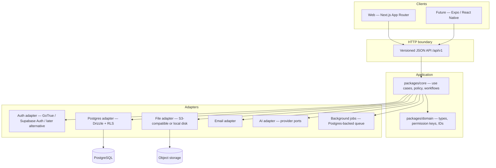
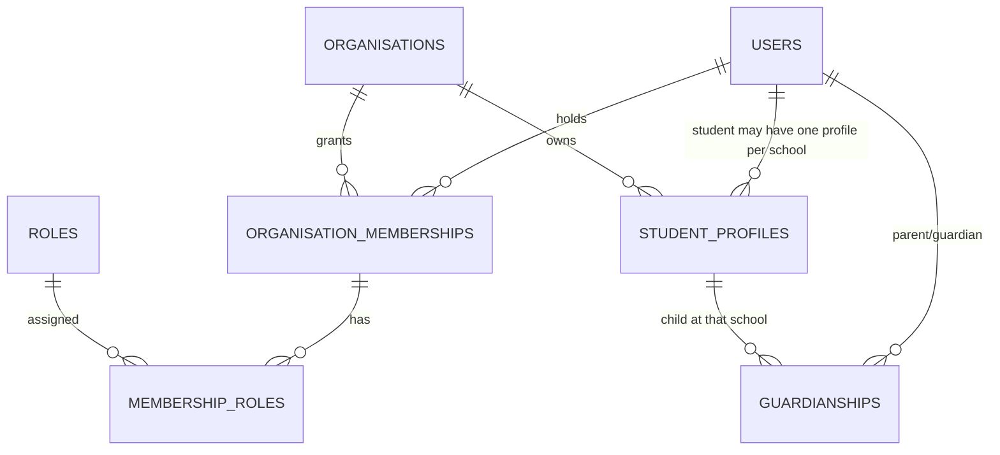
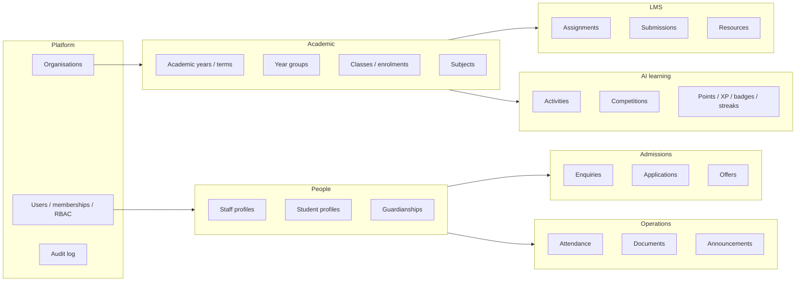

# Schoolapp — Platform Architecture

**Status:** Proposed for review. No product modules have been implemented yet.  
**Audience:** Product owner and engineering.  
**Scope:** Multi-tenant UK school SaaS (SIS + LMS + AI learning), web first, mobile-ready.

This document answers the ten architecture questions for the first phase of work. Supporting detail lives in:

| Document | Purpose |
| --- | --- |
| [ADR index](./adr/README.md) | Recorded technical decisions and rejected alternatives |
| [Domain model](./domain-model.md) | Entities, relationships, and lifecycle rules |
| [Proposed SQL](./schema/001_foundation.sql) | Reviewable foundation schema (not applied) |
| [HTTP API](./api/http-api.md) | Versioned API for web and future Expo apps |
| [UK compliance](./compliance/uk-schools.md) | GDPR, Children’s Code, safeguarding, hosting |
| [Roadmap](./roadmap.md) | Phased delivery; what we will *not* build yet |
| [Project structure](./project-structure.md) | Intended monorepo layout |
| [Permission catalogue](./permissions-catalogue.md) | Seed RBAC matrix for system roles |

---

## 1. Requirements analysis

### 1.1 What we are actually building

Schoolapp is three products that share one identity, tenancy, and permission model:

1. **School operations (SIS)** — admissions through to active pupils, year groups, classes, attendance, results, documents, and staff administration.
2. **Learning (LMS)** — homework, resources, submissions, marking, feedback, timetables.
3. **AI learning and gamification** — age-appropriate activities, teacher approval, points/XP/badges/streaks, configurable competitions and leaderboards.

The first customers are **independent UK schools** educating pupils roughly through **Year 8**, including **11+ preparation**. That implies Key Stages 1–3, not a full secondary sixth-form MIS.

### 1.2 Non-negotiable constraints

| Constraint | Architectural implication |
| --- | --- |
| Multiple independent schools on one platform | Tenant id on every school-owned row; RLS as a database safety net; no cross-tenant reads by default |
| Parents may have children at more than one school | **Global user identity**, **per-school memberships**. A parent is not “owned” by a single tenant |
| Students have their own accounts | Pupils are first-class users, not rows hanging off a parent. Login may be disabled for younger pupils |
| Same accounts on web and future mobile | One auth system, one API, one permission model. UI frameworks must not own business rules |
| Future iOS/Android (Expo/React Native) | Stable versioned HTTP JSON API, mobile-friendly auth (Bearer + refresh), no cookie-only session design |
| Possible self-hosting on Linux/Plesk | Standard PostgreSQL, Docker-friendly Node processes, no Vercel/Supabase-only features in domain code |
| AI without permanent vendor lock-in | Port/adapter around generation, moderation, and embeddings |
| Extensible roles | Permission catalogue + role bindings, not hardcoded `if (role === 'teacher')` throughout the app |
| Children’s data in the UK | Data minimisation, DPIA, UK/EU residency, audit, age-appropriate design, teacher review of AI content |

### 1.3 Explicitly out of scope for the first implementation waves

These must shape the model now, but must not be built yet:

- Native/Expo applications
- Full MIS parity with SIMS/Arbor/Bromcom
- School census / CTF import-export
- Finance, invoicing, and lunch money
- Safeguarding case management (beyond audit-friendly foundations)
- School-to-school competitions (until intra-school competitions are proven)
- Direct pupil–pupil messaging

Trying to ship all modules at once is the largest product risk. The schema and API boundaries below are designed so later modules plug in without rewriting tenancy or auth.

### 1.4 Primary user journeys that the architecture must not block

- Platform operator provisions a school and a School Admin.
- School Admin (or Admissions) captures an enquiry → application → offer → **admission converts a prospective pupil into an active student user**.
- A parent is invited, sets a password, and sees **only their children** (possibly across two schools by switching organisation context).
- A teacher sees **only their school**, and only the classes/pupils their permissions allow.
- A Year 3 pupil and a Year 8 pupil receive **different** activity catalogues, with AI drafts **unpublished until a teacher/admin approves** (where the school requires it).
- A future Expo parent app logs in with the **same identity** and calls the **same `/api/v1`** endpoints as the web parent portal.

---

## 2. Overall architecture

### 2.1 Style

**Modular monolith, API-first, adapter-backed infrastructure.**

One deployable web application and one PostgreSQL database at the start. Business rules live in framework-agnostic TypeScript (`packages/core`). HTTP adapters expose those rules to Next.js and, later, Expo. Infrastructure (auth, files, email, AI) is behind ports so Supabase, a Linux VM, or another provider can be swapped.

This is not microservices. Admissions, LMS, and AI learning share pupils, classes, and permissions. Splitting those into separate services early would multiply tenancy bugs without scaling benefit.



### 2.2 C4 container view

| Container | Responsibility | Notes |
| --- | --- | --- |
| **Web app** | Server-rendered and client UI for platform admin, school staff, parents, students | Next.js. Talks only to the public API + cookie session for browsers |
| **HTTP API** | Auth, tenancy context, authorisation, OpenAPI-documented resources | Initially Next.js Route Handlers under `/api/v1`. Extractable to a standalone Node server later |
| **Core services** | Use cases: “admit applicant”, “record attendance”, “publish activity” | No React, no Supabase client, no Next.js imports |
| **PostgreSQL** | System of record, RLS, audit | Standard Postgres 16+. Hosted by Supabase or self-hosted |
| **Auth service** | Passwords, sessions, MFA, recovery | Start with Supabase Auth (GoTrue). Web: cookies. Mobile: PKCE + refresh tokens |
| **Object storage** | Documents, submission files, avatars | S3 API (MinIO on self-host, Supabase Storage or any S3 in cloud) |
| **Worker** | AI generation, notifications, report PDFs | Same codebase, separate process; Postgres job table |
| **Expo apps** | Not built now | Will use API + Auth only; no direct database access |

### 2.3 Request path (every authenticated call)

1. Client sends session (cookie) or `Authorization: Bearer`.
2. API validates the token via the auth adapter and loads the **user**.
3. API resolves **organisation context** (`X-Organisation-Id` or stored last-used org). Platform Super Admin may omit org for platform routes only.
4. API sets the database session: `app.user_id`, `app.organisation_id`, `app.is_platform_admin`.
5. Use case runs with an explicit `Actor` (`userId`, `organisationId`, `permissions[]`).
6. Queries always include `organisation_id` in application code **and** RLS rejects mismatches.
7. Mutations write an **audit** row for sensitive actions.

Defence in depth: application checks + RLS. Neither is sufficient alone. Application checks encode role logic; RLS is the last barrier against a missed `WHERE organisation_id = …`.

### 2.4 Why Next.js is the web UI, not the system of record

Next.js Server Actions and cookies are convenient for the staff UI. They are a poor contract for Expo. **All capabilities that parents, students, or teachers will need on mobile must exist as HTTP JSON endpoints.** Server Actions may wrap those same use cases for the web UI, but they must not be the only entry point.

---

## 3. Recommended project structure

Monorepo (pnpm + Turborepo). TypeScript throughout.

```text
schoolapp/
├── apps/
│   ├── web/                 # Next.js App Router — staff, parent, student, platform admin
│   └── worker/              # Background jobs (AI, email, reports)
├── packages/
│   ├── domain/              # IDs, enums, permission catalogue, branded types
│   ├── core/                # Use cases and domain services (no UI, no Next.js)
│   ├── db/                  # Drizzle schema, helpers, RLS SQL as versioned migrations
│   ├── api-contract/        # OpenAPI source + generated TS types for web and Expo
│   ├── api-client/          # Typed fetch client used by web now, Expo later
│   ├── auth/                # Auth port + Supabase/GoTrue adapter
│   ├── storage/             # File port + S3 adapter
│   ├── notifications/       # Email/push ports
│   ├── ai/                  # AI ports + provider adapters
│   └── ui/                  # Web component library only (not for React Native)
├── supabase/                # Optional local config; not imported by core
├── docs/                    # This architecture set
└── infra/                   # Docker Compose, nginx samples for Plesk/Linux
```

**Do not** put React Native components in `packages/ui`. Shared *logic* lives in `core` / `api-client`. Shared *visuals* for mobile will be a later Expo package.

Route groups in `apps/web` (illustrative):

```text
app/
  (public)/                  # marketing, login, invite accept
  (platform)/platform/       # Super Admin
  (school)/                  # staff, requires org context
  (parent)/parent/           # parent portal
  (student)/student/         # student portal
  api/v1/                    # the mobile-ready HTTP API
```

A future `apps/mobile` (Expo) is a sibling app. It must not appear until the API is stable enough to consume.

---

## 4. Multi-tenant strategy

### 4.1 Chosen model: shared database, shared schema, `organisation_id` + RLS

| Model | Verdict |
| --- | --- |
| Database per school | Rejected for v1. Operationally heavy on Plesk; migrations and AI/ops become N-times work |
| Schema per school | Rejected for v1. Postgres RLS, pooling, and reporting across tenants are harder; parent-across-schools is awkward |
| **Shared schema + `organisation_id` + RLS** | **Chosen.** Standard SaaS; one migration stream; parents can hold memberships in many orgs |

Every school-owned table has `organisation_id uuid not null`. Global tables (users, platform config) do not.

### 4.2 Organisations are schools (and only schools at first)

`organisations` is the tenant. Fields include legal name, display name, slug, `country_code` (default `GB`), `timezone` (default `Europe/London`), academic calendar config, and feature flags (leaderboards on/off, AI generation on/off, student login on/off).

Trust boundaries:

- **Platform** — Super Admin: create/suspend organisations, impersonation only via a break-glass audited flow (not in v1 UI).
- **Organisation** — all pupil, staff, LMS, and admissions data.
- **No default school-to-school data path.** Cross-school competitions, if ever enabled, must be an explicit, separately modelled feature with its own consent and RLS, not a JOIN across `organisation_id`.

### 4.3 Identity is global; access is per organisation

This is the most important tenancy decision.



- A **user** is a person (staff, parent, student, or platform operator). Stored once.
- An **organisation membership** is that person’s relationship to a school, with status `invited | active | suspended`.
- **Roles bind to memberships**, not to the user globally (except platform Super Admin).
- A **student profile** is the school’s pupil record. The same human should not normally be a pupil at two schools at once; the model still uses `user_id` + `organisation_id` so transfers and dual registration can be represented later.
- A **guardianship** links a parent user to a student profile **at a school**. A parent with one child at School A and another at School B has two memberships and two guardianships.

Switching school in the UI (and later in the mobile app) changes `organisation_id` context. Tokens should not permanently hard-code a single school.

### 4.4 RLS policy pattern

Postgres session variables (set by the API after auth, never by the client):

- `app.user_id`
- `app.organisation_id`
- `app.is_platform_admin`

Illustrative policy:

```sql
create policy student_profiles_tenant_isolation
  on student_profiles
  for all
  using (
    current_setting('app.is_platform_admin', true) = 'true'
    or organisation_id = nullif(current_setting('app.organisation_id', true), '')::uuid
  )
  with check (
    current_setting('app.is_platform_admin', true) = 'true'
    or organisation_id = nullif(current_setting('app.organisation_id', true), '')::uuid
  );
```

**Parent reads** are not “all rows in my org”. After tenant isolation, a second layer restricts parents to student profiles listed in `guardianships` for that user. Teachers are restricted by class assignment or a school-configurable “all pupils” permission. RLS can encode the parent restriction; teacher-class restrictions may start in application code and be promoted into RLS when the class model is stable.

**Never** use the browser or mobile app to set `organisation_id` inside SQL. The client may *request* a context; the API verifies membership before setting the session variable.

### 4.5 Isolation tests (must exist before any portal ships)

Automated tests will:

1. Seed School A and School B with pupils.
2. Authenticate a teacher at A and assert HTTP 404/403 (not empty 200 with extra rows) for B’s ids.
3. Authenticate a parent with children in A and B; assert they can switch context and never see non-child pupils.
4. Attempt to pass School B’s `organisation_id` while holding only School A membership; assert rejection.
5. Run the same cases at SQL level with forged session variables where possible.

Returning **404** for cross-tenant IDs (instead of 403) avoids confirming that a UUID exists in another school.

---

## 5. Authentication and authorisation

### 5.1 Authentication (who you are)

**One identity provider for web and mobile.**

| Concern | Approach |
| --- | --- |
| Protocol | Email/password and invite links for staff and parents. Students: username or school-issued login, not necessarily email |
| Web | HTTP-only secure cookies (Supabase SSR pattern or equivalent) |
| Mobile (later) | OAuth2 PKCE / GoTrue session + refresh token in secure storage |
| MFA | Required for School Admin, Headteacher, and Platform Super Admin before production pupil data. Optional for other staff. Not for young pupils |
| Session | Short-lived access token; rotating refresh; server-side revocation list for staff |
| Lockout | Rate-limit login and invite redemption per IP and per account |

Students in Reception–Year 4 often cannot manage email. The identity model therefore allows `email` to be null and uses `username` + `organisation-scoped login alias` for pupils. Parents remain the account recovery path for those pupils (Children’s Code: high privacy default).

### 5.2 Authorisation (what you may do)

**RBAC + a permission catalogue**, not a frozen enum of eight roles.

```text
Permission key examples (namespaced):
  org.settings.read
  org.members.manage
  admissions.applications.manage
  students.profiles.read
  students.profiles.read_own_children   (parent)
  attendance.record.manage
  lms.assignments.manage
  lms.submissions.submit                (student)
  learning.activities.generate
  learning.activities.publish
  gamification.leaderboards.configure
```

Seeded **system roles** (keys stable; display names editable):

| Role key | Typical holder |
| --- | --- |
| `platform.super_admin` | Product operator (not a school role) |
| `school.admin` | School Admin |
| `school.headteacher` | Headteacher |
| `school.teacher` | Teacher |
| `school.admissions` | Admissions staff |
| `school.staff` | Other authorised staff (narrow default) |
| `school.parent` | Parent/Guardian |
| `school.student` | Student |

Schools may clone system roles and add custom roles later (`organisation_id` on `roles`, `is_system = false`). New modules register new permission keys; existing roles do not gain them until an admin grants them.

**Headteacher vs School Admin:** both are powerful. Defaults: School Admin owns tenancy, users, billing flags, integrations. Headteacher owns academic structure, reporting, and safeguarding-adjacent visibility. Exact matrices will be a spreadsheet in implementation Phase 1; the engine must not assume they are identical.

A user may be a **teacher at School A and a parent at School B**. Authorisation is always evaluated as `(user, organisation, membership roles)`. The UI must show the current context prominently.

### 5.3 Actor object

Every use case receives:

```ts
type Actor = {
  userId: string;
  userType: 'platform_admin' | 'staff' | 'parent' | 'student';
  organisationId: string | null; // null only for platform-level routes
  permissions: ReadonlySet<string>;
  studentProfileId?: string;     // when acting as pupil in this org
  guardianStudentIds?: string[]; // when acting as parent in this org
};
```

Use cases call `assertPermission(actor, 'attendance.record.manage')` and, for parent/student routes, `assertTouchesOwnChildren(...)`. HTTP layer maps failures to 401/403/404.

### 5.4 Auth vendor

**Start with Supabase Auth (GoTrue) as an adapter**, because it gives JWT, refresh, and a path to hosted or self-hosted GoTrue.

**Do not** sprinkle `supabase.auth.getUser()` through feature modules. `packages/auth` exposes `getSession`, `signIn`, `invite`, `issueStudentLogin`. Replacing GoTrue with Better Auth, Keycloak, or a custom service later should not rewrite admissions or LMS.

---

## 6. Initial database / domain model

Detail: [domain-model.md](./domain-model.md) and [schema/001_foundation.sql](./schema/001_foundation.sql).

### 6.1 Bounded contexts (modules)



Only **Platform + People + Academic structure** should be implemented first. Other contexts get **tables only when that phase starts**, but the foundation schema already includes extension points (`external_identifiers`, `audit_events`, organisation `settings` JSON for feature flags).

### 6.2 Foundation entities (Phase 1–2)

- `organisations`, `organisation_settings`
- `users`, `user_credentials_aliases` (student usernames)
- `organisation_memberships`, `roles`, `permissions`, `role_permissions`, `membership_roles`
- `invitations`
- `staff_profiles`, `student_profiles`
- `guardianships` (relationship, parental responsibility, portal access, priority)
- `academic_years`, `terms`, `year_groups`, `houses`, `classes`, `class_enrolments`, `subjects`
- `audit_events`
- `external_identifiers` (UPN, MIS ids — optional, access-restricted)

### 6.3 Later entities (do not implement now; reserved names)

- Admissions: `enquiries`, `applications`, `application_students`, `admissions_assessments`, `waiting_list_entries`, `offers`
- Operations: `attendance_sessions`, `attendance_marks`, `progress_reports`, `documents`, `announcements`
- LMS: `assignments`, `assignment_targets`, `submissions`, `learning_resources`, `timetable_entries`
- Learning: `learning_activities`, `activity_items`, `activity_reviews`, `activity_attempts`, `competitions`, `points_ledger`, `badge_definitions`, `streaks`

### 6.4 Critical lifecycle: applicant → student

Admission is a **state machine**, not an UPDATE that copies a name into `students`.

```text
enquiry → application → (assessment) → waitlist? → offer → accepted
  → provision student_profile + user + membership(student)
  → optional parent invite + guardianship
```

Prospective pupils live in admissions tables until conversion. They must not appear in class registers or parent “my children” until admitted (or a school flag allows “pre-admit portal”).

### 6.5 Soft deletes and retention

Prefer `status` + `archived_at` over hard deletes for pupils and attendance. UK schools often have legal retention duties that conflict with a naive GDPR “erase everything” button. Erasure becomes a **workflow** (export, anonymise, retain legally required records) — see compliance doc.

---

## 7. API / service layer for future mobile apps

### 7.1 Contract

A versioned **REST-style JSON API** under `/api/v1`, documented with OpenAPI 3. The same contract is consumed by:

- Next.js web (via `packages/api-client`)
- Future Expo apps (same client, or generated from the same OpenAPI)

GraphQL is not the v1 choice: authorisation and tenancy on a graph are easy to get wrong for pupil data. tRPC may be used **internally** only if it does not become the mobile contract; mobile should not depend on a TypeScript RPC runtime.

### 7.2 Rules that keep Expo straightforward

1. **JSON in / JSON out.** No HTML forms as the only write path.
2. **Bearer tokens work.** Cookie auth is additive for the browser, not exclusive.
3. **Organisation context is explicit.** Header `X-Organisation-Id` on school-scoped routes. The client lists `GET /v1/me/memberships` and selects one.
4. **Pagination, ETags/updated_at, and idempotency keys** on submissions and attendance writes (mobile networks retry).
5. **Error envelope** `{ error: { code, message, details? } }` with stable codes (`forbidden`, `org_context_required`, `child_not_linked`).
6. **No Superbase/PostgREST from the mobile app.** Mobile never holds the database anon key as a path to tables. That would force every policy to be perfect and would leak schema. The BFF/API is the only data plane.
7. **File uploads** via short-lived signed URLs from the API, not direct privileged storage keys in the app.
8. **Push notifications** later: device token registration endpoint now reserved (`/v1/me/devices`), implementation deferred.

### 7.3 Example parent mobile resources (same as web portal)

```http
GET  /api/v1/me
GET  /api/v1/me/memberships
GET  /api/v1/parent/children
GET  /api/v1/parent/children/{studentId}/attendance
GET  /api/v1/parent/children/{studentId}/assignments
GET  /api/v1/parent/children/{studentId}/results
POST /api/v1/me/push-tokens          # later
```

Student app uses `/api/v1/student/...` with permissions `lms.submissions.submit`, etc.

Staff app, if built, uses the same staff routes as the web SIS — still `/api/v1/...`, never a second backend.

### 7.4 Extraction path

If Next.js on Plesk becomes awkward, move `apps/web/app/api/v1` to `apps/api` (Hono or Fastify) and put nginx in front of `web` + `api`. Because use cases already live in `packages/core`, this is a move of HTTP adapters, not a rewrite.

---

## 8. Avoiding vendor lock-in

### 8.1 Principles

- **Postgres is the source of truth**, not a hosted product’s proprietary API.
- **Schema and migrations live in this repo** (`packages/db`), runnable against any PostgreSQL 16+.
- **Domain code depends on ports**, not SDKs.
- **Hosting assumes a Linux Node process + Postgres + S3-compatible storage + reverse proxy.** Vercel, Supabase Cloud, and Plesk are all deployment targets, not architectural assumptions.

### 8.2 What we will use vs what we will wrap

| Capability | v1 choice | Lock-in guard |
| --- | --- | --- |
| Database | PostgreSQL | Drizzle + SQL migrations; no Prisma Accelerate, no Neon-only features |
| Auth | Supabase Auth / GoTrue | `packages/auth` port; JWT is a standard |
| Files | S3 API | Adapter; MinIO for self-host |
| Realtime | Optional later | Prefer polling/SSE from our API before binding to Supabase Realtime |
| Email | SMTP or provider API | Adapter |
| AI | OpenAI or similar | `packages/ai` with `AiProvider` interface; store provider name + model on each generation record |
| Web hosting | Node `next start` behind nginx | Avoid Edge-only middleware, Vercel KV, Vercel Cron as the only scheduler |
| Jobs | `pg-boss` or equivalent on Postgres | No cloud-only queue required |
| Mobile | Expo later | API-first; Expo is a client |

### 8.3 Supabase: accelerator, not the product

Appropriate uses:

- Hosted Postgres in development / early production
- GoTrue for auth
- Storage if it speaks S3-compatible access via our adapter
- Local `supabase start` for developers

Inappropriate uses:

- PostgREST as the public API for tenants
- Client-side RLS as the only authorisation layer
- Edge Functions for core admissions/LMS logic
- Supabase-specific TypeScript types leaking into `packages/core`

Self-host path: Docker Compose with `postgres`, `web`, `worker`, `minio`, and either hosted GoTrue or a later auth adapter. Plesk can run Docker or a Node app + remote managed Postgres.

### 8.4 AI port (sketch)

```ts
interface AiLearningProvider {
  readonly id: string; // 'openai' | 'anthropic' | 'azure' | 'ollama'
  generateActivity(input: GenerateActivityInput): Promise<GeneratedActivityDraft>;
  moderate(input: ModerationInput): Promise<ModerationResult>;
}
```

Pupil-identifying data must not be sent to a provider unless the school’s DPA and our DPIA allow it. Generation prompts should use **year group, subject, and topic** — not name, UPN, or free-text teacher comments that contain other children.

---

## 9. UK school data protection and security (design influences)

Full note: [compliance/uk-schools.md](./compliance/uk-schools.md).

These are **engineering requirements**, not a legal opinion. A DPO / solicitor should review before processing live pupil data.

| Concern | Design influence |
| --- | --- |
| UK GDPR / DPA 2018 | Lawful basis per processing; data minimisation; tenant isolation; encryption in transit (TLS) and at rest; DPIA before AI and before profiling |
| ICO Children’s Code | High privacy defaults; geolocation off; profiling (personalised learning, leaderboards) off until school enables and understands it; parental controls; nudge techniques used carefully for gamification |
| Age of pupils (~4–13) | Parental consent/legitimate interest documented; student accounts recoverable by parent/school; no public profiles |
| Special category data | Do **not** model ethnicity, health, SEN, religion in Phase 1. When added, separate tables, stricter permissions, extra audit |
| KCSIE / safeguarding | Audit who viewed sensitive records; no unsupervised pupil–pupil chat; staff actions attributable to a user id |
| Data residency | Default region United Kingdom / EU; do not send pupil PII to US-only AI without appropriate transfer tooling and contracts |
| Retention | Soft delete + retention policy engine later; not unbounded “keep forever”, not instant hard delete |
| Security of processing | MFA for privileged staff; RLS; 404 on cross-tenant; secrets never in Expo app; penetration test before GA |
| Contracts | School is typically controller, we are processor — DPA, SCCs if needed, subprocessors list (hosting, email, AI) |
| DfE identifiers | UPN in `external_identifiers`, not as primary key; restricted read permission |
| Leaderboards | School-configurable; class/house scope; ability to hide names or disable entirely — children’s competitive ranking is a privacy and welfare issue |

**Logging:** no full names, emails, or UPNs in application logs by default; use UUIDs. Audit table is separate and access-controlled.

---

## 10. Phased development roadmap

Detail: [roadmap.md](./roadmap.md).

| Phase | Outcome | Build product modules? |
| --- | --- | --- |
| **0 — this document** | Architecture agreed | No |
| **1 — Foundation** | Monorepo, org, users, RBAC, audit, RLS tests, `/api/v1/me` | Platform only |
| **2 — People & school structure** | Staff, students, parents, year groups, classes | Yes, narrow |
| **3 — Portals (read)** | Parent/student web views of profile + school news | Yes, read-only |
| **4 — Admissions** | Enquiry to admitted pupil conversion | Yes |
| **5 — Attendance & documents** | Registers, files | Yes |
| **6 — LMS core** | Assignments, submissions, resources, marking | Yes |
| **7 — Assessment & reports** | Results, feedback, progress reports | Yes |
| **8 — AI learning** | Provider port, drafts, teacher approval, attempts | Yes |
| **9 — Gamification** | Points, badges, streaks, configurable leaderboards | Yes |
| **10 — Mobile** | Expo parent app, then student | New clients only |
| **11 — Integrations** | MIS, CTF, census, SSO | Later |

Each phase ships behind feature flags per organisation. Mobile starts only when the parent/student API has been used in production by the web portals (so the contract is proven).

---

## 11. Important technical decisions and risks

### Decisions to confirm before implementation

1. **Shared-schema multi-tenancy with RLS** (not database-per-school).
2. **Global users + per-school memberships** (required for multi-school parents).
3. **API-first `/api/v1`** as the mobile contract; Next.js is the first client.
4. **Supabase as optional infrastructure**, not the public data API.
5. **Drizzle + SQL migrations** for Postgres portability.
6. **Permission catalogue** rather than hardcoded roles.
7. **No special-category pupil fields in Phase 1.**
8. **AI outputs are drafts** until a human with `learning.activities.publish` approves, unless a school explicitly allows auto-publish (off by default).
9. **Leaderboards off by default.**
10. **Self-host shape = Docker Compose + nginx + Node + Postgres.**

### Risks (honest)

| Risk | Why it matters | Mitigation |
| --- | --- | --- |
| Scope explosion | SIS + LMS + AI is several commercial products | Strict phases; architecture now, modules later |
| Cross-tenant parent bugs | Highest impact security defect | Isolation tests; explicit org header; 404 on foreign IDs |
| RLS vs performance | Naive policies on large attendance tables | Tenant column first in indexes; policy tests; `organisation_id` always in WHERE |
| Children’s Code vs gamification | Leaderboards and streaks can be harmful or non-compliant if public/personalised by default | Flags, school control, no public internet leaderboards |
| AI data leakage | Providers may train on or retain prompts | Strip PII; DPA; UK/EU endpoints; log generations without pupil names |
| Next.js on Plesk | Not a first-class host | `next start` + reverse proxy; extraction path to `apps/api` |
| Student login for young children | Usability vs security | Optional student login per year group; parent-managed |
| Replacing the school MIS | Schools still need finance, census, safeguarding tools | Position as complementary until integrations exist; stable `external_identifiers` |
| Hardcoded Supabase in UI | Would block self-host and complicate Expo | Adapters only |

---

## 12. What happens after review

If this architecture is accepted, Phase 1 implementation should be a **thin vertical slice**:

- pnpm monorepo + `apps/web` hello-world
- `organisations`, `users`, memberships, RBAC seed
- RLS enabled and tested
- `GET /api/v1/me` and `GET /api/v1/me/memberships`
- Platform Super Admin can create a school; School Admin can invite a user

No admissions, LMS, or AI in that slice.

If any decision above is rejected (for example, database-per-tenant, or GraphQL-first), update the ADRs before writing application code. Changing tenancy after pupil data exists is far more expensive than changing a UI framework.
